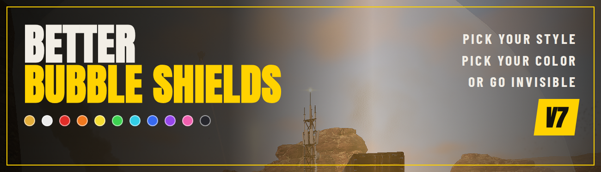

# Better Bubble Shields

**Every bubble shield in Helldivers 2 your way.** Pick a style and one of 11 colors for each shield separately, in your mod manager. The color covers the whole shield: the bubble, its hit flash, the glow on its generator and the effect when it breaks. Formerly *Clear Bubble Shields*.

Current version: **v7** · [Download](https://github.com/Th3chef/Better-Bubble-Shields/releases/latest) (`Better-Bubble-Shields-v7.zip` under Assets, not the source code)

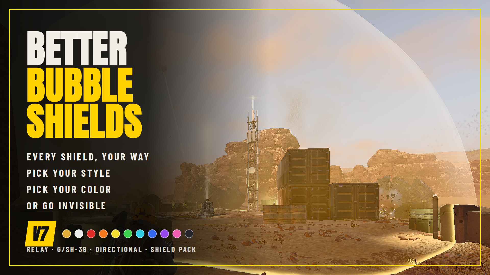

## Features

**Styles** (per shield)
- **Honeycomb** (default): keeps the honeycomb but removes the swirling cloud and ripple, and is much more see-through.
- **Clear - Medium**: no honeycomb or cloud, just an even tint at 50% opacity, so you can still tell where the shield is.
- **Clear - Low**: no honeycomb or cloud, a faint tint at 25% opacity.
- **Invisible**: no shield bubble at all. The generator glow, hit flash and break effect still show, in the shield's color.

**Colors** (per shield, in their own dropdown): the game's own color, White, Red, Orange, Yellow, Green, Cyan, Blue, Purple, Pink or Dark (a smoky dark tint). Every color works with every style. The color also covers:
- the **hit flash** when the bubble is shot,
- the **glow on the generator**: the electric arcs and glowing core of the Relay and the Shield Generator Pack, and the glowing band on the G/SH-39 grenade,
- the **break effect**: the flash, shards and sparks when the shield goes down.

Colors are brightness-matched, so blue and purple look as bright as the game's default, and the white-hot cores of the effects stay white-hot. **Game Default** leaves all of it as the game made it.

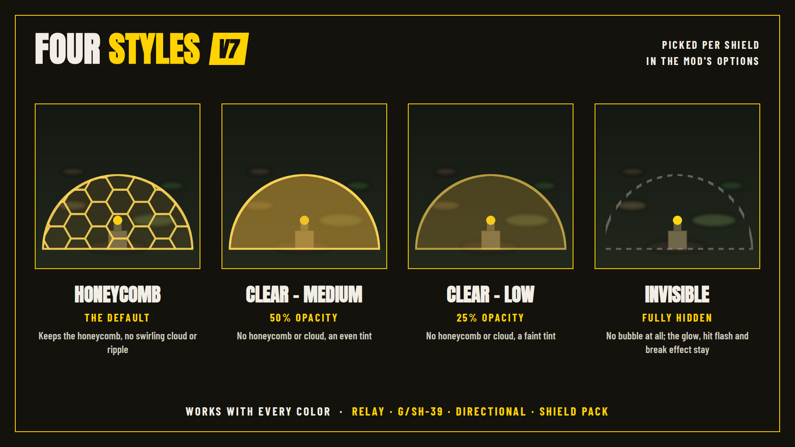
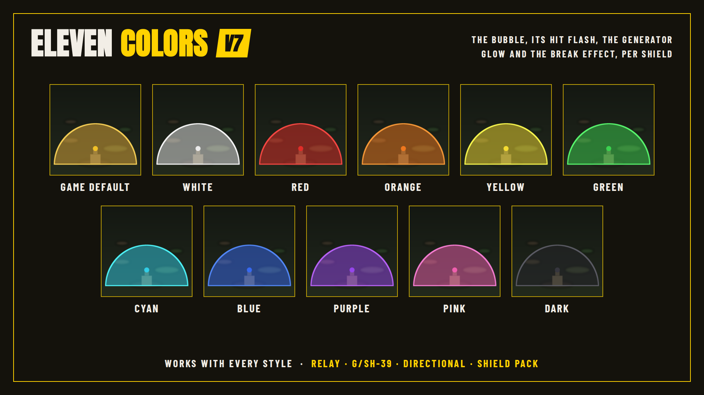

## Affected shields

- **FX-12 Shield Generator Relay** (the dome, the generator's glow and the break effect)
- **G/SH-39 Shield** (the shield grenade: the bubble, the grenade's glow and the break effect)
- **SH-51 Directional Shield** (the shield panel and its break effect)
- **SH-32 Shield Generator Pack** (the dome, its glowing layer and the line along its top, the glow on the backpack and the break effect)

## Options

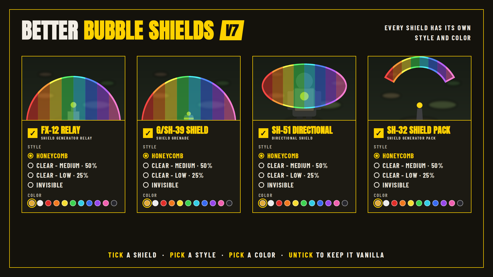

Each shield has two options in your mod manager:
- **The shield option** (for example *FX-12 Shield Generator Relay*): tick it to change that shield and pick its style. Untick it to keep the shield vanilla.
- **The Color option** (for example *Relay - Color*): pick the color. It needs the shield option above it turned on.

## Requirements

- Helldivers 2 (built for the September 2026 game version).
- Arsenal or another Helldivers 2 mod manager that supports mod options (manifest `Options`). Manual install also works (below).

## Install / update

**Mod manager (recommended):** add `Better-Bubble-Shields-v7.zip` to Arsenal, open the mod's options, tick the shields you want, pick a style and a color for each, then confirm and deploy.

**Updating from v6:** it installs as an update and your settings stay; deploy again so the new color files are used.
**Updating from Clear Bubble Shields v5 or older:** it's the same mod, so it installs as an update. The options changed, so open them and pick your settings again.

**Manual:** every option folder in the zip holds a set of three patch files, all named `9ba626afa44a3aa3.patch_0`. For each shield you want, copy into `Helldivers 2\data`: its `Textures` set, one `Style` set and optionally one `Color` set. Rename each set to the next free patch number (`patch_0`, `patch_1`, ...), keeping the three files of a set on the same number. The Color set must get a higher number than the Style set.

## Uninstall

Disable or remove the mod in your mod manager and deploy, or delete the patch files you copied into the data folder.

## Compatibility

- Conflicts with other mods that change the same shields: the bubble models of the Relay, G/SH-39 Shield and Directional Shield, the Shield Generator Pack's dome effect and, with a color picked, the shields' generator glow and break effects. Whichever mod loads last wins for that shield. Untick a shield here to leave it to the other mod.
- Does not touch armor, weapons, backpack models or any other visuals. The effect materials the shields share with other effects in the game are never changed: the mod uses its own recolored copies.
- Built for the September 2026 game version. After a game update the build checks the game's shield files and is rebuilt from them in one step if they changed.

## Known limitations

- The Shield Generator Pack's bubble is the same model as the Relay and G/SH-39 bubbles, so the Pack's bubble and its hit flash follow those shields' Style and Color. The Pack's own options cover its glowing dome layer, the glow on the backpack and its break effect.
- A Color option does nothing while its shield option is off.

## How it works

Each shield's bubble model is pointed at the mod's own materials, one per style, so the style and the color can be picked in separate dropdowns. The honeycomb and cloud texture slots use tiny plain textures of the mod's own. The Shield Generator Pack's dome is a particle effect, so its color is set in that effect and its brightness in its materials. A Color option also sets the bubble's hit-flash color and ships the shield's own glow and break effects with their colors changed; the materials those effects share with other effects are pointed at the mod's own recolored copies, so nothing outside these shields changes.

| Shield | Vanilla | Better Bubble Shields |
|---|---|---|
| Shield Generator Relay | 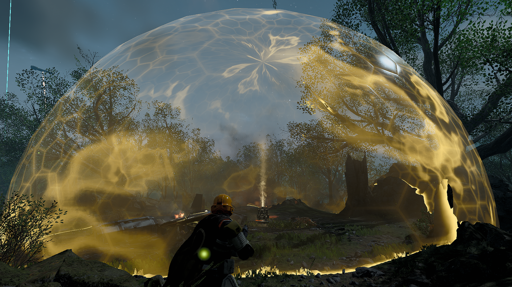 | 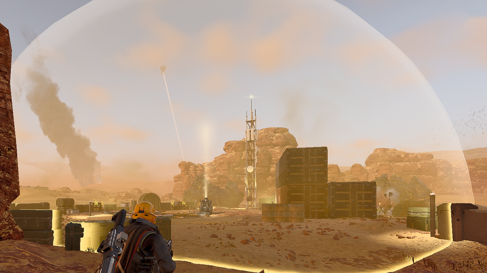 |
| Shield Generator Pack | 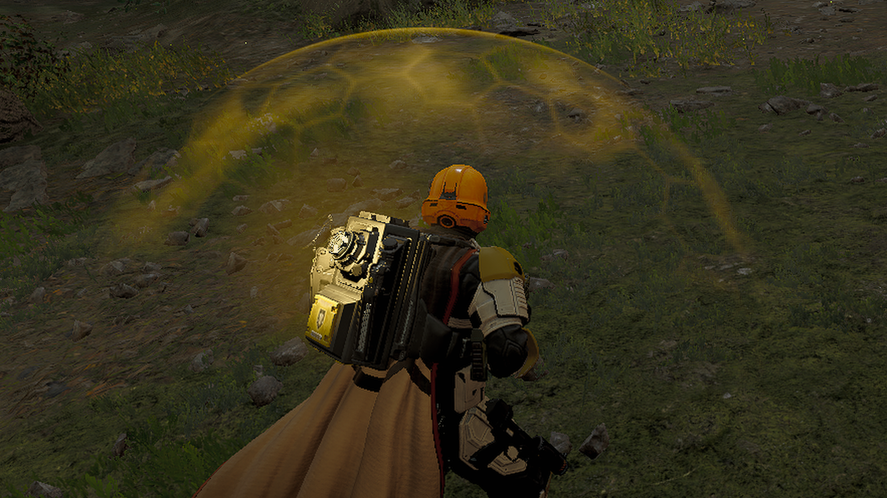 | 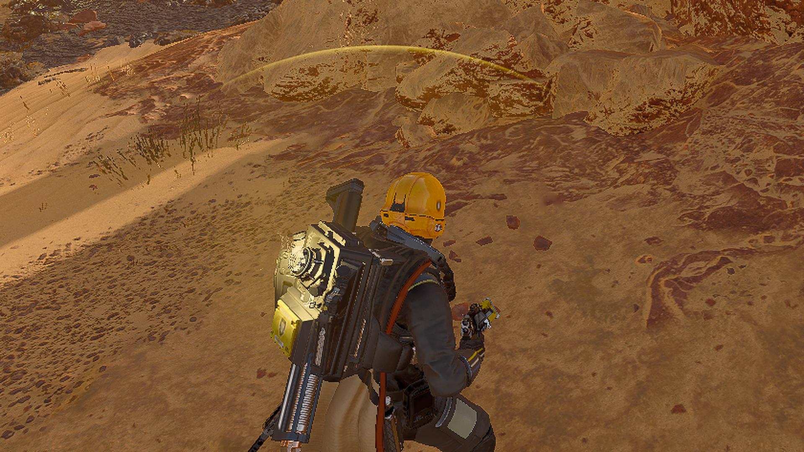 |
| Directional Shield | 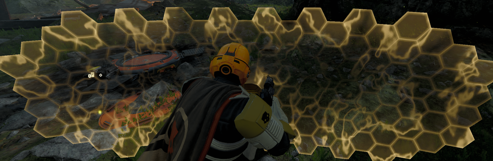 | 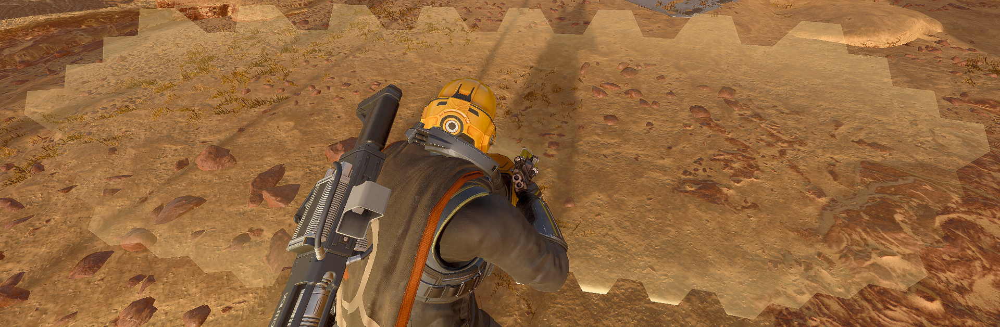 |

## Troubleshooting

- **A color doesn't show:** make sure the shield's own option (the one with the style) is ticked too. The Color option needs it.
- **Nothing changes:** deploy again in your mod manager after changing options, and check that no other shield mod loads after this one.
- **Shields look wrong after a game update:** the update may have changed the shields. [Open a bug report](https://github.com/Th3chef/Better-Bubble-Shields/issues/new/choose) with a screenshot; the mod is rebuilt from the new game files in one step.

This mod has no log file (it only changes the game's look; nothing runs in the game).

## Building from source

Everything that builds the release zip is in [`src/`](src) (run the commands from there). The game's own files are not stored here; the build reads them from your game install.

1. Python 3 with Pillow and NumPy. Go 1.25+ to build the extractor.
2. Build the extractor (`src/tools/hd2raw`, a small lister/extractor on top of [Filediver](https://github.com/xypwn/filediver)'s reader); see `src/tools/hd2raw/README.txt`.
3. `python tools/unpack_release.py Better-Bubble-Shields-v7.zip` recreates `v5-options/` (the base materials each style starts from and the mod's own textures) from the release zip.
4. `python update.py "<Helldivers 2>/data"` finds and extracts the game files the build needs into `game/`. Exit code 0 = no update needed, 2 = the game's files changed (rebuild), 1 = needs a person.
5. `python build_v7.py` then `python icons_v7.py`, and zip the contents of `build/`. On the September 2026 game this rebuilds `Better-Bubble-Shields-v7.zip` byte for byte.

`art/make_art.py` makes the thumbnail, header and gallery images (Playwright; see the notes at its top).

## Credits

- **Muchacho5894**: [Bubble Shields - No honeycomb - No cloud - 0.1 Opacity](https://www.nexusmods.com/helldivers2/mods/14108), the original idea for the Shield Generator Relay. This mod uses its own textures.
- **Filediver** by xypwn and contributors: [github.com/xypwn/filediver](https://github.com/xypwn/filediver), used to find and extract the game's shield files.
- **Helldivers 2 SDK: Community Edition** by Boxofbiscuits97 and contributors, based on the original SDK by ToastedShoes, Kboy and Irastris: [github.com/Boxofbiscuits97/HD2SDK-CommunityEdition](https://github.com/Boxofbiscuits97/HD2SDK-CommunityEdition), used for the material format and shader variable names.

## License

Copyright (c) 2026 Th3chef. All rights reserved. You may read the source, report bugs and suggest fixes; ask before reusing it or reuploading the mod. See [LICENSE](LICENSE).
